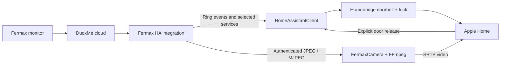

# Architecture

The goal is software-only Apple Home integration for a Fermax VEO-XS WiFi / DUOX PLUS entrance: current doorbell alerts, explicit door release and optional video. The project began with a Python/Home Assistant plan in November 2025 and evolved into this Node Homebridge plugin.

## Connection modes

| Component | Responsibility |
|---|---|
| `FermaxPlatform` | Selects one entrance, restores its accessory, starts listeners and handles shutdown |
| `HomeAssistantClient` | Authenticated REST commands, snapshots, preview activation and WebSocket ring events |
| `FermaxClient` | Direct OAuth, device discovery, door release and stored photocaller images |
| `FermaxPushClient` | Experimental direct Firebase registration, account-scoped credentials and persistent deduplication |
| `FermaxAccessory` | Doorbell service and a timed door-release display |
| `FermaxCamera` | HomeKit negotiation, FFmpeg video transcoding, SRTP output and cleanup |
| `FileStore` | Atomic, private credential/cache files |

Home Assistant mode reuses upstream mediasoup/WebRTC handling and exposes its media through authenticated MJPEG. Direct mode does not implement cloud video negotiation; it can restream a separately verified external source. Neither mode assumes the monitor has a generic RTSP endpoint.

## Access and reliability

- Explicit mismatches and ambiguous entrance selection fail setup.
- Physical door commands are not replayed after uncertain network or server failures. One bounded authentication retry can follow an explicit 401 rejection.
- Account/client/API-scoped tokens prevent accidental cache reuse between accounts. New cache files are written atomically with owner-only permissions; old unscoped caches are ignored.
- Requests, body reads and camera startup have deadlines. Shutdown cancels requests, backoff, listeners, timers and camera children.
- Ring recovery suppresses historical events. Events during an outage can be missed.
- FFmpeg startup requires encoded-frame progress; diagnostic output is not treated as success or logged with media credentials.

The HomeKit lock display is a timer, not a door-position sensor. There is no physical secure command. Video has no audio or HomeKit Secure Video recording. HAP exposes a camera stream service even without a configured media source; an attempted stream then reports unavailable.

## Project authorities

`src/` defines behavior, `config.schema.json` defines the Homebridge form, `package.json` and its lockfile define dependencies, and [development notes](development.md) record verification limits. [Research](research.md) records dated upstream evidence. Credentials belong on the deployment host, never in Issues or pull requests.
